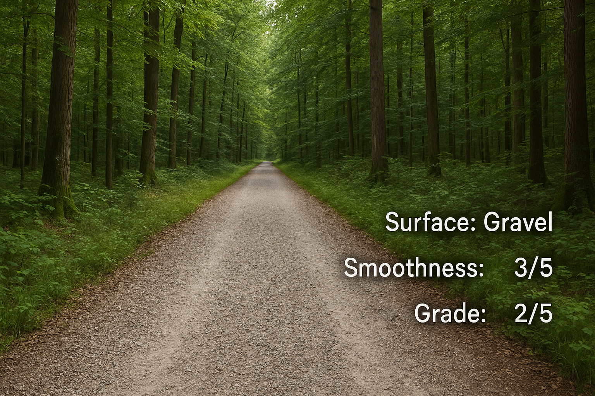

# TRAILS – ML-Based Terrain Recognition And Labeling  

TRAILS is a machine-learning project that analyzes off-road (gravel) cycling terrain using **video/photo** and **GPS data**.  
By classifying surface types (e.g., gravel, dirt, asphalt) from ride footage, TRAILS maps conditions to precise locations.  
The system provides **post-ride insights** to help cyclists choose the best tires for grip and performance based on real riding conditions.  

---

*Example: Photorealistic frame classified with Surface = Gravel, Smoothness = 3/5, Grade = 2/5*  

---

## 🚴 Project Goals  

- Build a system that can classify off-road cycling terrain from ride videos or photos.  
- Correlate each frame with GPS coordinates to create a **terrain map of the ride**.  
- Provide cyclists with a data-driven basis for tire choice, grip, and performance.  
- Optionally integrate terrain data into **OpenStreetMap** for broader community use.  

---

## 🛠️ Project Workflow  

1. **Record the ride**  
   - Capture both **video** and **GPS track** simultaneously.  

2. **Extract frames**  
   - Break down video into frames and match each frame with its GPS coordinate (via timestamp).  

3. **Classify surfaces**  
   - Predict attributes such as:  
     - **Surface type** (gravel, dirt, asphalt, etc.)  
     - **Track grade** (e.g., Grade 1–5)  
     - **Smoothness** (ordinal scale)  

4. **Visualize results**  
   - Map classifications on a ride map (Leaflet / Mapbox).  
   - Provide per-segment insights for post-ride analysis.  

---

## 📊 Model Architecture (planned)  

- **Shared backbone** (CNN/Transformer for feature extraction).  
- **Multi-task heads**:  
  - Surface classification (multi-label, BCEWithLogitsLoss).  
  - Track grade classification (ordinal).  
  - Smoothness classification (ordinal).  
- Designed for **interpretability** and **attribute-specific outputs**.  

---

## 📂 Training Data Sources  

- Semi-handpicked images/videos from [Mapillary](https://www.mapillary.com/).  
- Own cycling footage captured during gravel rides.  
- Supplementary material from **Wikimedia Commons**.  

---

## 🌍 Future Directions  

- Improve **ordinal classification** (CORN / OrdinalCE loss).  
- Expand dataset for better generalization.  
- Real-time classification on-device during rides.  
- Publish processed terrain data to **OpenStreetMap**.  

---

## 📸 Demo  

  

Surface: Gravel  
Smoothness: 3/5  
Grade: 2/5  

---

## ⚖️ License  

This project is released under the MIT License.  
See [LICENSE](LICENSE) for details.  